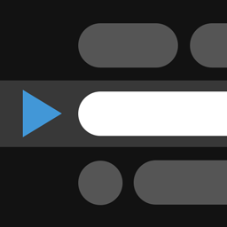

TelePrompter - Change Log
===

> Here is the history of all the changes made to our TelePrompter app.

:white_check_mark: v1.2.2 Release Notes ( January 29th, 2023 )
---

- [X] Added Help link to GitHub Project for easier access to support

:white_check_mark: v1.2.1 Release Notes ( December 31st, 2022 )
---

- [X] Added support for Docker Instances ( thanks [mcoms](https://github.com/mcoms) )
- [X] Added GitHub Issue Templates and Project Documentation

:white_check_mark: v1.2.0 Release Notes ( June 16th, 2021 )
---

### :tada:  New Features

- [X] Made TelePrompter and Remote ADA Compliant.  Failed pretty horribly to do this in prior releases, but it's now been tested for Visual Impairment Issues, Keyboard Navigation Support & Screen Reader Access.
- [X] Updated Layout to work on Desktop, Tablet & Mobile Screen Sizes
- [X] Added ability to Save / Share Settings. All config settings are now saved in the URL as well, so you can bookmark and/or share the link and the TelePrompter will load with those settings.  Super handy if you are are on a shared computer where people keep changing your settings ;)  Thanks for the great idea [snchzantonio](https://github.com/snchzantonio) with your Feature Request in [Issue #10](https://github.com/manifestinteractive/teleprompter/issues/10).
- [X] Added the ability to manage Font Size, Page Speed and Scroll Position with a Slider.  This is a pretty sweet idea from [migeru-san](https://github.com/migeru-san) in Feature Request [Issue #31](https://github.com/manifestinteractive/teleprompter/issues/31).  Now you can quickly drag the slider to exactly where you want it without having to press a button over and over ( though we kind of fixed that too ).
- [X] Added Support for Presentation Remotes ( mapped common key presses use by remotes ).  Now you can use your favorite remote that you already do presentations with to control the TelePrompter.  Not sure why we did not think of this one ourselves.  Special thanks to [prust](https://github.com/prust) for bringing this up in [PR #28](https://github.com/manifestinteractive/teleprompter/pull/28)
- [X] Added the ability to manage whether to dim the overlay and controls using the new eye ball icon in the main menu.  Not everyone wants all the controls and the majority of the text to fade out when using TelePrompter, and we hear you.  Special thanks to [alon](https://github.com/alon) for the original suggestion in [PR #1](https://github.com/manifestinteractive/teleprompter/pull/1)
- [X] Added a Confirmation Dialog to the Close Remote button.  Now we won't shut down the remote just because you were curious what the button did.  Thanks to [migeru-san](https://github.com/migeru-san) for the suggesting in Feature Request [Issue #32](https://github.com/manifestinteractive/teleprompter/issues/32).
- [X] Added Press & Hold support for Remote Buttons.  It was super annoying having to press the button over and over again to get what you wanted.  Now, you can press and hold the primary remote buttons, and they will just keep firing until you let it you.
- [X] Added missing Text Rotation buttons to the Remote so now all the buttons on the TelePrompter also exist on the Remote.
- [X] Updated Code so it can be more easily run from any server ( apparently hard coding our site was not super helpful for an open source project, oopsie daisy )
- [X] Added [DEVELOPERS.md](DEVELOPERS.md) to instruct developers on how to get their own version of this application running on their own server.
- [X] Exposed JavaScript methods so TelePrompter could be automated ( see [DEVELOPERS.md](DEVELOPERS.md) )
- [X] Added Software Update Modal to announce software updates for users that have already used the app ( only shown once per new release )
- [X] Added Service Worker so TelePrompter can be installed as a Browser App
- [X] Updated Node Dependencies to the latest and greatest ( app not requires Node 12+ to run )
- [X] Updated Third Party JavaScript Libraries to latest stable releases
- [X] Updated Remote Server to enable CORS for Modern Browsers
- [X] Updated App Icons

### :warning:  Bug Fixes

- [X] Using the Escape Key while editing the TelePrompter will exit editing the TelePrompter.  This was called out by [aaronpk](https://github.com/aaronpk) in [PR #16](https://github.com/manifestinteractive/teleprompter/pull/16) and was also a reported bug in [Issue #15](https://github.com/manifestinteractive/teleprompter/issues/15)
- [X] Fixed Zero Speed Bug in [Issue #12](https://github.com/manifestinteractive/teleprompter/issues/12) where if you had set the speed to zero, it still moved.  Special thanks to [donniebreve](https://github.com/donniebreve) for contributing the fix to this in [PR #19](https://github.com/manifestinteractive/teleprompter/pull/19)
- [X] Fixed Typos caught by [marclaporte](https://github.com/marclaporte) in [PR #23](https://github.com/manifestinteractive/teleprompter/pull/23)
- [X] Fixed Annoying Text Shift during Playback for Windows users as reported by [prust](https://github.com/prust) in [PR #27](https://github.com/manifestinteractive/teleprompter/pull/27)
- [X] Fixed weird bug where if you had a Remote connected to TelePrompter, then refreshed the TelePrompter, it would kill your connection to the remote.  That helped no one, and is fixed.
- [X] Fixed rendering glitch when browser first loads when there are custom settings that were being applied just after page load, causing it to jump around a bit.
- [X] Heavily Refactored to improve Performance

:white_check_mark: v1.1.1 Release Notes ( April 28th, 2020 )
---

- [X] Fixed Text Transform bug for [Issue #21](https://github.com/manifestinteractive/teleprompter/issues/21)

:white_check_mark: v1.1.0 Release Notes ( June 29th, 2019 )
---

- [X] Added Remote Control to allow managing TelePrompter from an external device
- [X] Switched over to using Local Storage rather than depending on Cookies ( kept fallback support for old cookies )

:white_check_mark: v1.0.0 Release Notes ( February 16th, 2015 )
---

:tada: - Initial Release
