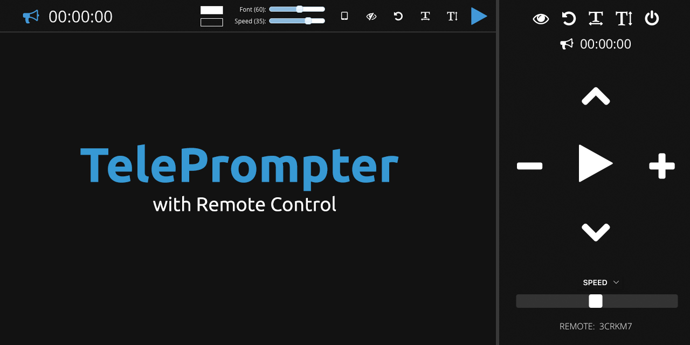

Project Support
===

If you or your company enjoy using this project, please consider supporting my work and joining my discord. 💖

------

TelePrompter
===

> Browser-based TelePrompter with Remote Control

Features
---

- [X] Edit Text in Browser
- [X] Changes Saved Automatically
- [X] Handy Keyboard Shortcuts
- [X] Advanced Controls
- [X] Remote Control Support

Free to Use
---

Our Open Source TelePrompter is Available Online:

Keyboard Shortcuts
---

Key              | Alternatives                            | Description
:---------------:|:---------------------------------------:|:--------------------------
<kbd>↑</kbd>     |                                         | Increase Font Size
<kbd>↓</kbd>     |                                         | Decrease Font Size
<kbd>←</kbd>     | <kbd>PAGE UP</kbd>                      | Slow Down Teleprompter
<kbd>→</kbd>     | <kbd>PAGE DOWN</kbd>                    | Speed Up Teleprompter
<kbd>SPACE</kbd> | <kbd>B</kbd> <kbd>F5</kbd> <kbd>.</kbd> | Start / Stop Teleprompter
<kbd>ESC</kbd>   |                                         | Resets GUI

We also made an effort to make sure your text will be easy to read.   So if you are pasting text from a word document, we'll do some cleaning up to make the breaks flow more easily.
